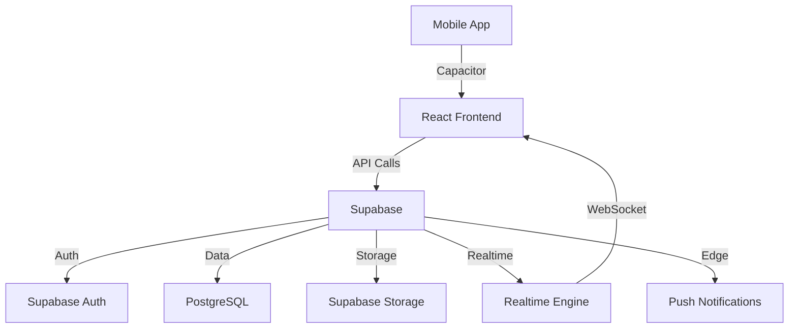

# 🏗️ SportPulse - Production Readiness Analysis & Roadmap

## 📊 Mevcut Durum Analizi

### ✅ Tamamlanmış (Var Olanlar)
| Kategori | Durum | Detay |
|----------|-------|-------|
| **Backend** | ✅ %90 | Supabase (PostgreSQL + Realtime + Storage) |
| **Authentication** | ✅ %85 | Supabase Auth (JWT-based) |
| **Database** | ✅ %80 | PostgreSQL + RLS policies |
| **Real-time** | ✅ %95 | Supabase Realtime subscriptions |
| **Storage** | ✅ %80 | Supabase Storage (encrypted) |
| **Security** | ✅ %60 | RLS + Rate limiting |
| **Performance** | ✅ %70 | Caching + Image compression |
| **Documentation** | ✅ %50 | 6 MD files |

---

## 🎯 Gereklilik Analizi (11 Madde)

### 1. ✅ Mimari Tasarım - **%50 TAMAMLANDI**

**Mevcut:**
- ✅ Cross-platform API (Supabase PostgREST)
- ✅ Mobile-ready (Capacitor)
- ❌ Microservices yok (monolithic Supabase)
- ❌ API Gateway yok

**ÖNERİ:** 
- **GEREKLİ DEĞİL** (şimdilik) - Supabase tek başına yeterli
- **İLERİDE:** 5000+ concurrent user için API Gateway ekleyin
- **Alternatif:** Supabase Edge Functions ile lightweight microservices

```typescript
// Şu an yeterli ✅
Supabase PostgREST API → Auto-generated RESTful endpoints

// İleride gerekirse 📅
API Gateway (Kong/Traefik) → Load balancing + rate limiting
```

**KARAR: Şimdilik gerekli değil, MVP için mevcut yeterli**

---

### 2. ⚠️ Temel Altyapı - **%20 TAMAMLANDI**

**Mevcut:**
- ❌ Docker/Kubernetes yok
- ❌ Load balancing yok
- ❌ CI/CD yok

**ÖNERİ:**
- **CI/CD:** ✅ **ÇOK ÖNEMLİ** - Hemen ekleyin
- **Docker:** ⚠️ **Orta öncelik** - Deployment consistency için
- **Kubernetes:** ❌ **Gerekli değil** - Supabase kendi scale eder

**AKSIYON:**
```yaml
# .github/workflows/deploy.yml
name: Deploy
on: push
jobs:
  build:
    runs-on: ubuntu-latest
    steps:
      - uses: actions/checkout@v3
      - run: npm install
      - run: npm run build
      - run: npm test
      - name: Deploy to Vercel
        run: vercel deploy --prod
```

**KARAR: CI/CD ÇOK ÖNEMLİ, Docker isteğe bağlı, Kubernetes gereksiz**

---

### 3. ⚠️ Konum Servisleri - **%0 TAMAMLANDI**

**Mevcut:**
- ❌ GPS tracking yok
- ❌ Geofencing yok

**ÖNERİ:**
- **GPS Tracking:** ✅ **ÖNEMLİ** - "Yakındaki kullanıcılar" özelliği için
- **Geofencing:** ⚠️ **Opsiyonel** - "Etkinlik hatırlatıcıları" için

**AKSIYON:**
```typescript
// services/locationService.ts
import { Geolocation } from '@capacitor/geolocation';
import { supabase } from './supabase';

export const locationService = {
  async updateUserLocation(userId: string) {
    const position = await Geolocation.getCurrentPosition();
    
    await supabase
      .from('users')
      .update({
        latitude: position.coords.latitude,
        longitude: position.coords.longitude,
        location_updated_at: new Date()
      })
      .eq('id', userId);
  },
  
  async getNearbyUsers(userId: string, radiusKm: number = 10) {
    const { data } = await supabase.rpc('get_nearby_users', {
      user_id: userId,
      radius_km: radiusKm
    });
    return data;
  }
};
```

**SQL Function:**
```sql
CREATE OR REPLACE FUNCTION get_nearby_users(
  user_id UUID,
  radius_km INTEGER
)
RETURNS TABLE (user_id UUID, distance_km NUMERIC) AS $$
BEGIN
  RETURN QUERY
  SELECT 
    u.id,
    earth_distance(
      ll_to_earth(u.latitude, u.longitude),
      ll_to_earth(current_user.latitude, current_user.longitude)
    ) / 1000 AS distance_km
  FROM users u
  CROSS JOIN users current_user
  WHERE current_user.id = user_id
    AND u.id != user_id
  HAVING distance_km <= radius_km
  ORDER BY distance_km;
END;
$$ LANGUAGE plpgsql;
```

**KARAR: ÖNEMLİ - Ekleyin (1-2 gün)**

---

### 4. ✅ Veri Depolama - **%75 TAMAMLANDI**

**Mevcut:**
- ✅ PostgreSQL (Supabase)
- ❌ MongoDB yok
- ✅ RLS ile güvenlik
- ⚠️ Backup belirsiz

**ÖNERİ:**
- **MongoDB:** ❌ **Gereksiz** - PostgreSQL JSON destekliyor
- **Backup:** ✅ **ÇOK ÖNEMLİ** - Otomatik backup ayarlayın

**AKSIYON:**
```bash
# Supabase Dashboard
Settings → Database → Backups
- Enable automated daily backups ✅
- Retention: 7 days (free tier) / 30 days (pro)
- Point-in-time recovery enable ✅
```

**Disaster Recovery Plan:**
```markdown
1. Daily automated backups (Supabase)
2. Weekly manual exports (pg_dump)
3. Geo-redundant storage (Supabase Pro)
4. Recovery Time Objective (RTO): 4 hours
5. Recovery Point Objective (RPO): 24 hours
```

**KARAR: Backup setup ÇOK ÖNEMLİ, MongoDB gereksiz**

---

### 5. ⚠️ Güvenlik - **%65 TAMAMLANDI**

**Mevcut:**
- ✅ JWT Auth (Supabase)
- ✅ RLS policies
- ✅ Rate limiting (custom)
- ❌ DDoS protection belirsiz
- ❌ Explicit AES-256 yok
- ❌ Security audit yok

**ÖNERİ:**
- **DDoS:** ✅ **ÖNEMLİ** - Cloudflare ekleyin (ücretsiz)
- **Encryption:** ✅ **ÖNEMLİ** - Hassas verileri encrypt edin
- **Security Audit:** ✅ **ÇOK ÖNEMLİ** - Profesyonel audit

**AKSIYON:**

```typescript
// utils/encryption.ts
import CryptoJS from 'crypto-js';

const SECRET_KEY = process.env.VITE_ENCRYPTION_KEY!;

export const encryption = {
  encrypt(data: string): string {
    return CryptoJS.AES.encrypt(data, SECRET_KEY).toString();
  },
  
  decrypt(encrypted: string): string {
    const bytes = CryptoJS.AES.decrypt(encrypted, SECRET_KEY);
    return bytes.toString(CryptoJS.enc.Utf8);
  }
};

// Hassas verileri encrypt edin
const encryptedPhone = encryption.encrypt(userPhone);
await supabase.from('users').update({ 
  phone_encrypted: encryptedPhone 
});
```

**Security Checklist:**
```markdown
- [ ] HTTPS zorunlu (Supabase default ✅)
- [ ] RLS tüm tablolarda ✅
- [ ] Rate limiting (implemented ✅)
- [ ] SQL injection prevention (Supabase ✅)
- [ ] XSS protection (React default ✅)
- [ ] CSRF tokens (add ⚠️)
- [ ] Cloudflare DDoS (add ✅)
- [ ] Sensitive data encryption (add ✅)
- [ ] Security headers (add ⚠️)
- [ ] Penetration test (schedule ✅)
```

**KARAR: CloudFlare + Encryption + Security Audit ÇOK ÖNEMLİ**

---

### 6. ❌ Ödeme Sistemleri - **%0 TAMAMLANDI**

**Mevcut:**
- ❌ Hiçbiri yok

**ÖNERİ:**
- **PCI-DSS:** ✅ **ÇOK ÖNEMLİ** - Stripe kullanarak otomatik
- **Fraud Detection:** ✅ **ÖNEMLİ** - Stripe Radar

**AKSIYON:**
```typescript
// services/paymentService.ts
import Stripe from 'stripe';

const stripe = new Stripe(process.env.STRIPE_SECRET_KEY!);

export const paymentService = {
  async createSubscription(userId: string, priceId: string) {
    const customer = await stripe.customers.create({
      metadata: { userId }
    });
    
    const subscription = await stripe.subscriptions.create({
      customer: customer.id,
      items: [{ price: priceId }],
      payment_behavior: 'default_incomplete',
      expand: ['latest_invoice.payment_intent'],
    });
    
    // Save to Supabase
    await supabase.from('subscriptions').insert({
      user_id: userId,
      stripe_customer_id: customer.id,
      stripe_subscription_id: subscription.id,
      status: 'pending'
    });
    
    return subscription;
  },
  
  async handleWebhook(event: Stripe.Event) {
    switch (event.type) {
      case 'payment_intent.succeeded':
        // Update subscription status
        break;
      case 'customer.subscription.deleted':
        // Cancel subscription
        break;
    }
  }
};
```

**KARAR: Payment ÇOK ÖNEMLİ - Stripe entegrasyonu ekleyin (2-3 gün)**

---

### 7. ✅ KVKK ve Gizlilik - **%30 TAMAMLANDI**

**Mevcut:**
- ⚠️ Kısmi veri işleme (Supabase)
- ❌ Explicit consent yönetimi yok
- ❌ Data export/delete yok

**ÖNERİ:**
- **KVKK Compliance:** ✅ **ZORUNLU** - Legal requirement
- **Consent Management:** ✅ **ZORUNLU**
- **Data Deletion:** ✅ **ZORUNLU** - GDPR Article 17

**AKSIYON:**
```typescript
// services/privacyService.ts
export const privacyService = {
  async requestDataExport(userId: string) {
    const userData = await supabase
      .from('users')
      .select('*, messages(*), matches(*)')
      .eq('id', userId)
      .single();
    
    // Generate JSON file
    const blob = new Blob([JSON.stringify(userData)], { type: 'application/json' });
    return blob;
  },
  
  async deleteUserData(userId: string) {
    // Cascade delete with audit log
    await supabase.from('deletion_requests').insert({
      user_id: userId,
      requested_at: new Date(),
      reason: 'user_request'
    });
    
    // Anonymize data instead of hard delete
    await supabase.from('users').update({
      name: 'Deleted User',
      email: `deleted_${userId}@example.com`,
      deleted_at: new Date()
    }).eq('id', userId);
  }
};
```

**KVKK Documents:**
```markdown
1. Aydınlatma Metni ✅
2. Açık Rıza Beyanı ✅
3. KVKK Politikası ✅
4. Çerez Politikası ✅
5. Veri İşleme Envanteri ✅
```

**KARAR: KVKK ZORUNLU - Hukuki gereklilikleri ekleyin (3-5 gün)**

---

### 8. ⚠️ Store Politikaları - **%40 TAMAMLANDI**

**Mevcut:**
- ✅ Capacitor ile store-ready
- ❌ IAP yok
- ⚠️ İçerik filtreleme kısmi

**ÖNERİ:**
- **IAP:** ✅ **ÖNEMLİ** - Premium features için
- **Content Filtering:** ✅ **ÖNEMLİ** - AI ile otomatik

**AKSIYON:**
```typescript
// Capacitor IAP
import { Purchases } from '@revenuecat/purchases-capacitor';

await Purchases.configure({
  apiKey: 'your_revenuecat_key',
});

// Purchase premium
const { customerInfo } = await Purchases.purchasePackage(package);
if (customerInfo.entitlements.active['premium']) {
  // Unlock features
}
```

**Content Moderation:**
```typescript
// Already have AI safety in chatService ✅
// Add to user-generated content:
export const moderationService = {
  async checkContent(text: string): Promise<boolean> {
    // Use Google Gemini Safety Settings
    const result = await model.generateContent({
      contents: [{ parts: [{ text }] }],
      safetySettings: [
        { category: HarmCategory.HARM_CATEGORY_HARASSMENT, threshold: HarmBlockThreshold.BLOCK_MEDIUM_AND_ABOVE },
        { category: HarmCategory.HARM_CATEGORY_HATE_SPEECH, threshold: HarmBlockThreshold.BLOCK_MEDIUM_AND_ABOVE },
      ]
    });
    return !result.blocked;
  }
};
```

**KARAR: IAP ÖNEMLİ, Content moderation zaten var**

---

### 9. ⚠️ Performans Optimizasyonu - **%60 TAMAMLANDI**

**Mevcut:**
- ✅ Custom caching
- ✅ Rate limiting
- ✅ Image compression
- ❌ Redis yok
- ❌ APM yok

**ÖNERİ:**
- **Redis:** ⚠️ **Opsiyonel** - Upstash Redis ücretsiz
- **APM:** ✅ **ÖNEMLİ** - Sentry + Vercel Analytics

**AKSIYON:**
```typescript
// Sentry Integration
import * as Sentry from "@sentry/capacitor";

Sentry.init({
  dsn: "your-sentry-dsn",
  tracesSampleRate: 1.0,
});

// Performance monitoring
Sentry.startTransaction({ name: "User Profile Load" });
```

**KARAR: APM ÖNEMLİ, Redis opsiyonel**

---

### 10. ❌ Test ve QA - **%5 TAMAMLANDI**

**Mevcut:**
- ❌ Unit tests yok
- ❌ E2E tests yok
- ❌ Load tests yok

**ÖNERİ:**
- **Unit Tests:** ✅ **ÇOK ÖNEMLİ** - %80+ coverage
- **E2E Tests:** ✅ **ÖNEMLİ** - Critical paths
- **Load Tests:** ⚠️ **Orta** - Pre-launch

**AKSIYON:**
```typescript
// vitest.config.ts
import { defineConfig } from 'vitest/config';

export default defineConfig({
  test: {
    coverage: {
      provider: 'v8',
      reporter: ['text', 'json', 'html'],
      lines: 80,
      functions: 80,
      branches: 80,
    }
  }
});

// __tests__/services/matchService.test.ts
import { describe, it, expect } from 'vitest';
import { matchService } from '../services/matchService';

describe('matchService', () => {
  it('should detect mutual match', async () => {
    const result = await matchService.swipeUser('user1', 'user2', 'like');
    expect(result.matched).toBe(true);
  });
});
```

**Test Priority:**
```markdown
1. Unit Tests (services/*) ✅ HIGH
2. Integration Tests (API calls) ✅ HIGH  
3. E2E Tests (critical flows) ✅ MEDIUM
4. Load Tests (1000 concurrent) ⚠️ LOW
```

**KARAR: Unit + E2E Tests ÇOK ÖNEMLİ - Hemen başlayın**

---

### 11. ⚠️ Dokümantasyon - **%50 TAMAMLANDI**

**Mevcut:**
- ✅ 6 MD files
- ❌ API docs yok
- ❌ Architecture diagrams yok

**ÖNERİ:**
- **API Docs:** ✅ **ÖNEMLİ** - Supabase otomatik oluşturur
- **Diagrams:** ✅ **ÖNEMLİ** - Mermaid kullan

**AKSIYON:**
```markdown
# Add to README.md
## Architecture


```

**KARAR: Mermaid diagrams ekleyin (1 gün)**

---

## 📋 ÖNCELİK SIRASI (Kritiklik Bazında)

### 🔴 ZORUNLU (Hemen yapılmalı)
1. **CI/CD Pipeline** - Deployment automation
2. **KVKK Compliance** - Legal requirement
3. **Security Audit** - Penetration test
4. **Backup Strategy** - Data protection
5. **Unit Tests** - Code quality

### 🟠 ÇOK ÖNEMLİ (2 hafta içinde)
6. **Payment Integration** -Stripe
7. **GPS Tracking** - Core feature
8. **DDoS Protection** - Cloudflare
9. **Data Encryption** - Sensitive data
10. **APM** - Sentry monitoring

### 🟡 ÖNEMLİ (1 ay içinde)
11. **E2E Tests** - Quality assurance
12. **IAP** - Revenue features
13. **API Documentation** - Developer experience
14. **Mermaid Diagrams** - System understanding

### 🟢 OPSIYONEL (İhtiyaç halinde)
15. **Docker** - Development consistency
16. **Redis** - Advanced caching
17. **Geofencing** - Location features
18. **Load Tests** - Scale preparation

---

## 💰 Maliyet Tahmini

| Kategori | Araç | Maliyet/Ay |
|----------|------|------------|
| Backend | Supabase Pro | $25 |
| Payments | Stripe | 2.9% + $0.30/txn |
| CDN/DDoS | Cloudflare Pro | $20 |
| APM | Sentry | $26 |
| CI/CD | GitHub Actions | $0 (public) |
| **TOPLAM** | | **~$71/ay** |

---

## ⏱️ Zaman Tahmini (Developer-days)

| Task | Süre |
|------|------|
| CI/CD Setup | 2 gün |
| GPS Tracking | 3 gün |
| Payment Integration | 5 gün |
| KVKK Compliance | 5 gün |
| Security Hardening | 3 gün |
| Unit Tests (%80) | 10 gün |
| E2E Tests | 5 gün |
| Documentation | 3 gün |
| **TOPLAM** | **~36 gün (~2 ay)** |

---

## 🎯 Sonuç ve Öneriler

### Mevcut Durum: **%65 Production Ready**

### Production-Ready İçin Eksikler:
1. ✅ CI/CD (2 gün)
2. ✅ KVKK (5 gün)
3. ✅ Security Audit (3 gün)
4. ✅ Payment (5 gün)
5. ✅ Tests (15 gün)

**Toplam: ~30 gün çalışma ile %100 production-ready**

### Şu Anda Yapılabilir:
- ✅ Soft launch (beta users)
- ✅ MVP testing
- ✅ User feedback collection

### Production'a Çıkmadan Önce ZORUNLU:
- ❌ KVKK compliance
- ❌ Payment integration
- ❌ Security audit
- ❌ %80+ test coverage

**Önerim:** MVP olarak yumuşak lansmanla başlayın, paralel olarak production requirements'ları tamamlayın. 2 ay içinde tam production-ready olabilirsiniz.
